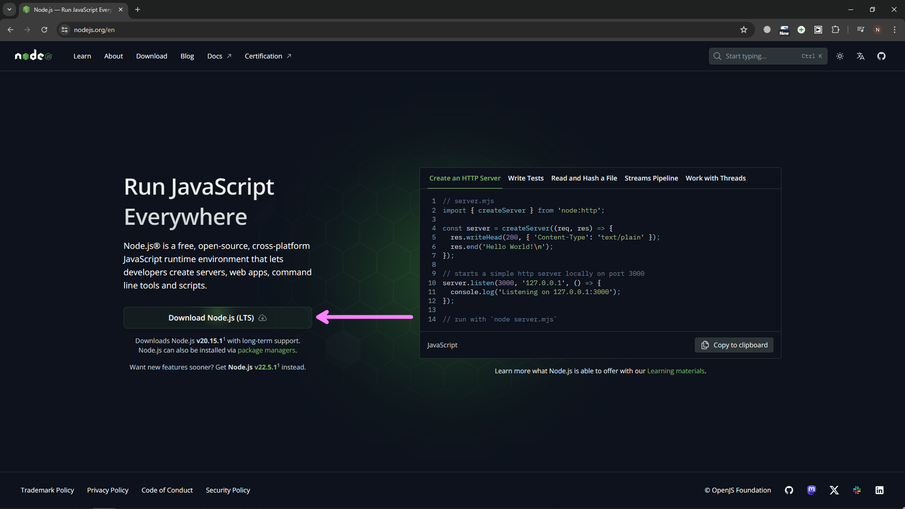
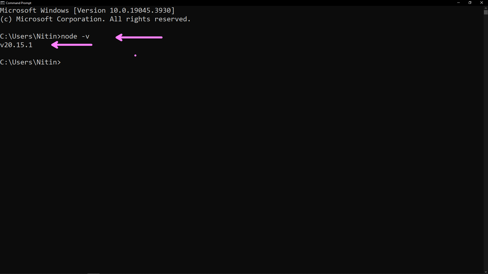
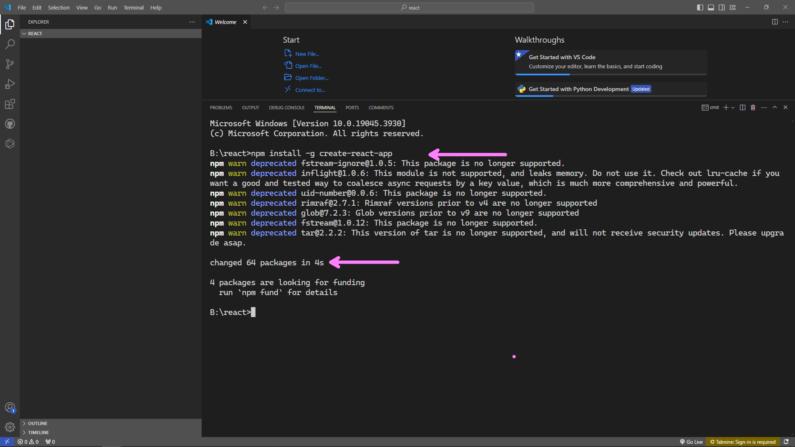
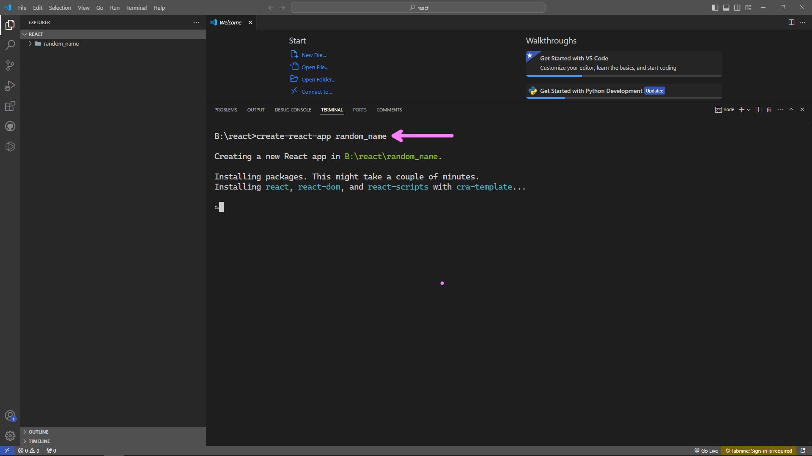
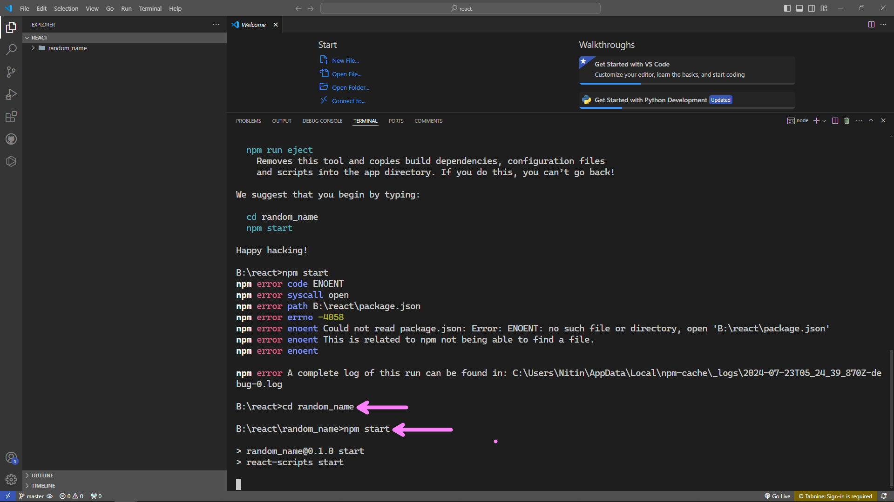
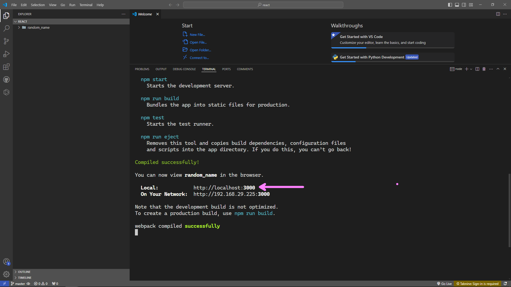

# React Project Structure.
This task walks through the the inital React project structure, all you have to do is follow the steps below and create a new project structure for your React application.

# Step 1: Install Nodejs (if not already installed)
<h2>
<ul>
  <li>Go <a href = "https://nodejs.org/en</">Here</a></li>
  <li>Download the Nodejs LTS.</li>
  <li>Install Nodejs without making any changes in the setup and just by pressing Next in the installation wizard.</li>
  <li>Ensure the Node is installed by running the following command ```node -v``` in the command prompt/terminal window.</li>
  <ul>
</h2>






# Step 2: Create a React Project.

<h2>
<ul>
<li>Create an new folder and name it as per you choice</li>
<li>Open the newly created folder in VS Code</li>
<li>Open the Terminal inside the code and run the following commands</li>

</ul>
</h2>


## ``` npm install -g create-react-app  ```
## ``` create-react-app random_name```
## ``` cd random_name ```
## ``` npm start ```

<h2>
    <ul>
    <li>Open the browser and go to the application on the provided URL by the node.</li>
    </ul>
</h2>







