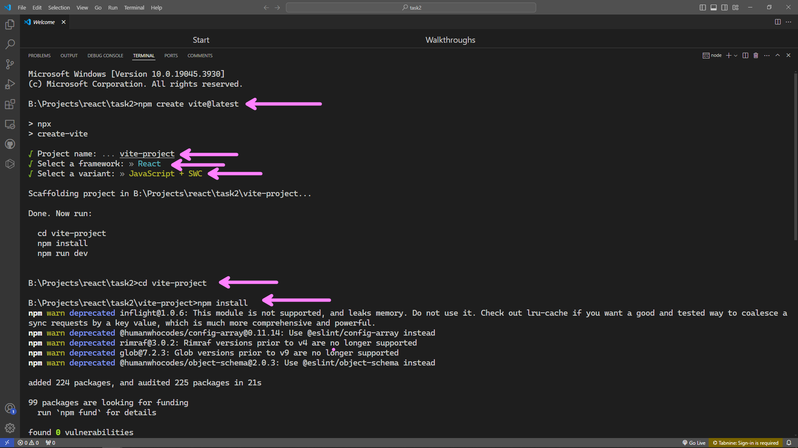
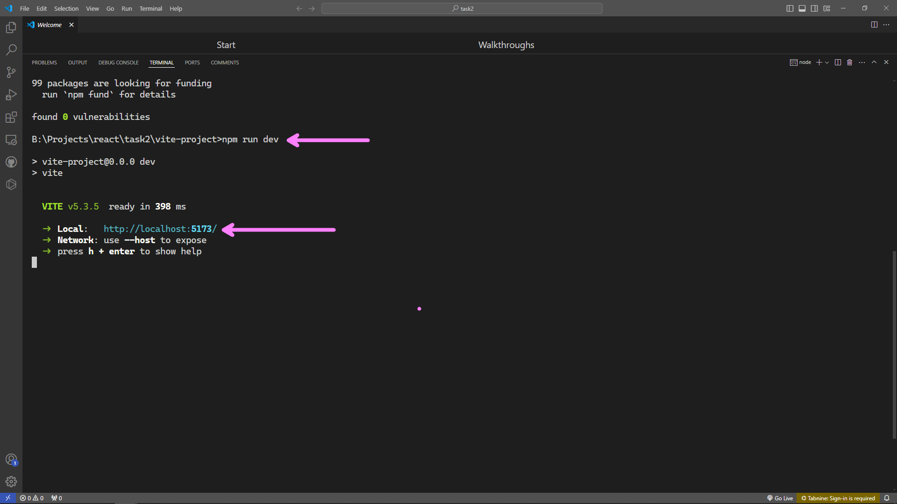

# React Project Structure(With Vite)

## This task walks through the the inital React project structure with vite as it is much faster, all you have to do is follow the steps below and create a new project structure for your React application.

# Step 1 : Make sure Nodejs is installed(if not already installed check the first task for the setup guide)

# Step 2 : Create a React Project.

<h2>
<ul>
<li>Create an new folder and name it as per you choice</li>
<li>Open the newly created folder in VS Code</li>
<li>Open the Terminal inside the code and run the following commands</li>

</ul>
</h2>

## ``` npm create vite@latest  ```
## Name the project as per your choice
## Select "React" as framework using the arrow key and press enter to confirm it.
## Select "Javascript + SWC" as the language using the arrow key and press enter to confirm it.

## Test the project buy running the following command.

## ```cd project_name_used```
## ```npm install```
## ```npm run dev```

## Follow the URL provided by the pervious command to open and view the project.



